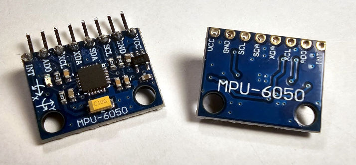

# Toit driver for Invensense (TDK) MPU6000 and MPU6050 I2C Accelerometer and Gyroscope
The MPU6000 and MPU6050 are compact 6-axis motion tracking sensors that combine
a 3-axis accelerometer and a 3-axis gyroscope on a single chip.  They measures
linear acceleration and rotational velocity.  They communicate via I²C (or SPI
depending on model).  It's a cheap and popular choice for projects that need
motion detection, orientation sensing, or gesture control.



> [!WARNING]
> This device is allegedly obsolete.  It is quoted as being noisy and outdated.
> However they are still cheap, widely available, and good enough for many
> projects such as mine, making a driver worth the time to write.

A practical implementation of this device is shown in this ['Digital
Dice'](https://github.com/milkmansson/project-dice) project.

## Feature Completeness
This has gone a bit further than originally intended.  The tech in this chip is
genuinely impressive, and going down this rabbit hole has been educational.
Much of the coolest stuff is undocumented, and/or, like MotionApps, behind an
agreement/wall with TDK that no longer exists.

#### Current Version:
As a baseline, the base class `Mpu6050` (in
[`/src/mpu6050.toit`](src/mpu6050.toit)) contains any/all features without
resorting to DMP/MotionApps.  Non-DMP (eg, in toit code in the driver/class)
implementations of features found in DMP funtions are also here.  It functions
well so far for individual reads, interrupts, motion events, fifo, etc, even if
it might be improved over time.

#### Development:
In the [development branch](tree/development) the following are being worked on:
- Base [`mpu6050`](blob/development/src/mpu6050.toit) class:
  - Giving MPU6050 3 more axes:  The device has an auxiliary independent I2C bus,
    hosted on pins XDA/XCL.  They're designed to put an I2C magnetometer behind
    them to get full AHRS etc.  Whilst devices with magnetometers built-in already
    exist, this is still a cheap and functional method.
  - Self-Test/Self-Calibration features
  - Free Fall - exists but not well tested yet.  (Needs a more robust build than
    a solderless breadboard.)
  - X/Y/Z Fine Gain Control.
- DMP version [`mpu6050-dmp-ma612`](blob/development/src/mpu6050-dmp-ma612.toit) of the class:
  - **DMP:** 'Digital Motion Processor' and 'Motion Fusion' features.  As the name
    implies, its being based on the MotionApps 6.12 sourced from
    [i2cdevlib](https://www.i2cdevlib.com/devices/mpu6050) and the work put in
    at [Jeff Rowberg's
    repo](https://github.com/jrowberg/i2cdevlib/tree/master/Arduino/MPU6050). Status: in progress.
      - 'Tap' Gesture is underway, 'Step Counter' is next.
  - **FIFO buffer:** This currently works, although consuming the information
    from it, and controlling the rates and sources of inforation appearing in it
    is still not quite there.  It features strongly in how DMP features are
    consumed, so is actively being worked on.
  - **Full AHRS implementation:** This was interesting and expectation is that
    this will be completely possible.  Status: Some time away for now.  See:
    [Open Source IMU and AHRS
    algorithms](https://x-io.co.uk/open-source-imu-and-ahrs-algorithms/) and
    [Fusion Library](https://github.com/xioTechnologies/Fusion)
  - **Calibration:** Much better features and capabilities exist when using DMP.
    This is also being surfaced.


## Features

### Gyroscope Data
Each gyroscope sample from the MPU6050 gives angular velocity, i.e., how fast
the device is rotating around each axis at that moment.  its usually represented
in degrees/second for each of the three axes.  Note that this is not a universal
orientation, but a measure of **change** of orientation.
This 3-part measurement is obtained using Toit
[Math](https://libs.toit.io/math/library-summary) library's
[`Point3f`](https://libs.toit.io/math/class-Point3f) object.  Gyroscope
measurement can be obtained by:
```Toit
// Required for math objects
import math

// I2C setup omitted
new-gyro := ?
new-gyro = mpu6050-driver.read-gyroscope    // returns math.Point3f object

// Print single measurement
print "$(%0.2f new-gyro.x)deg/sec x"
print "$(%0.2f new-gyro.y)deg/sec y"
print "$(%0.2f new-gyro.z)deg/sec z"
```

### Accelerometer Data
One measurement from the accelerometer on the MPU6050 represents the
instantaneous acceleration being experienced by the sensor, split along its
three orthogonal sensing axes (X, Y, Z).  Similar to the gyroscope, the xyz data
is provided in a Toit [`Point3f`](https://libs.toit.io/math/class-Point3f)
object, as per this example:
```Toit
// Required for math objects
import math

// I2C setup omitted
new-accel := ?
new-accel = mpu6050-driver.read-acceleration    // returns math.Point3f object

// Print single measurement
print "$(%0.2f new-accel.x)g x"
print "$(%0.2f new-accel.y)g y"
print "$(%0.2f new-accel.z)g z"
```
See the 'continuous-accel-read' example.  Note that when the device is sitting
there doing nothing physical, the axis representing gravity will remain at the
value of g (gravitational acceleration - 9.80665 m/s²), for that axis:
```Text
[jaguar] INFO: program ea3248cd-18e0-7373-4ee4-0cff10ff4ebe started
 Found Mpu60x0 on 0x68
 get-whoami returned: 0x34
 get-temperature returned: 20.483c
 execute-gyro-self-test now:
 read-accel returned: 1.0459x.g 0.0337y.g 0.0269z.g
 read-accel returned: 1.0437x.g 0.0312y.g 0.0295z.g
 read-accel returned: 1.0488x.g 0.0312y.g 0.0288z.g
 read-accel returned: 1.0447x.g 0.0234y.g 0.0276z.g
 read-accel returned: 1.0388x.g 0.0386y.g 0.0247z.g
 read-accel returned: 1.0457x.g 0.0234y.g 0.0156z.g
 read-accel returned: 1.0457x.g 0.0356y.g 0.0273z.g
 ...
```

### Motion Detection
This device can provide alerts when going from zero motion into motion, and vice
versa.  There are thresholds determining how much motion is necessary to trigger
each of these.  Its a somewhat undocumented feature however it functions very
well using information from the community. A simple example:
```Toit
// I2C setup omitted
// MOVEMENT DETECTION: Suggested starting values 20–40mg, for 20–50ms.
STILL-TO-MOTION-MG := 40   // force required to register motion. Bigger value = more movement required.
STILL-TO-MOTION-MS := 5    // duration of that force required to register motion. = Bigger value = movement required for longer.

// STILL DETECTION: Suggested starting values 5–10mg, for 600ms.
MOTION-TO-STILL-MG := 10   // forces on the device need to be less than this many milli-g's.
MOTION-TO-STILL-MS := 576  // ... for at least this duration of milliseconds.

// Configure Interrupt Pin, Defaults, and wake MPU6050
interrupt-pin = gpio.Pin interrupt-pin-number --input  --pull-down
mpu6050-driver.set-clock-source Mpu6050-dmp-ma612.CLOCK-SRC-INTERNAL-8MHZ
mpu6050-driver.wakeup-now

// Reset all internal signal paths
mpu6050-driver.reset-gyroscope
mpu6050-driver.reset-accelerometer
mpu6050-driver.reset-temperature

// Disable Unused Bits
mpu6050-driver.disable-temperature
mpu6050-driver.disable-gyroscope

// Configure Digital High Pass Filter - so slow tilt doesn’t look like motion.
mpu6050-driver.set-accelerometer-high-pass-filter Mpu6050-dmp-ma612.ACCEL-HPF-0-63HZ

// Set Zero-Motion to Motion Detection (ms = milliseconds, mg=milli G's)
mpu6050-driver.set-motion-detection-duration-ms STILL-TO-MOTION-MS
mpu6050-driver.set-motion-detection-threshold-mg STILL-TO-MOTION-MG
mpu6050-driver.enable-interrupt-motion-detection

// Set Motion to Zero Motion Detection (ms = milliseconds, mg=milli G's)
mpu6050-driver.set-zero-motion-detection-duration-ms MOTION-TO-STILL-MS
mpu6050-driver.set-zero-motion-detection-threshold-mg MOTION-TO-STILL-MG
mpu6050-driver.enable-interrupt-zero-motion-detection

// Set interrupt pin to go high when activated
mpu6050-driver.set-interrupt-pin-active-high
mpu6050-driver.disable-fsync-pin

// Set up interaction - keep pin active until values read.
mpu6050-driver.enable-interrupt-pin-latching
mpu6050-driver.set-interrupt-pin-read-clears
mpu6050-driver.set-dlpf-config Mpu6050-dmp-ma612.CONFIG-DLPF-3

// Set decrement rates and delay for freefall and motion detection
mpu6050-driver.set-motion-detection-count-decrement-rate 1
mpu6050-driver.set-free-fall-count-decrement-rate 1
mpu6050-driver.set-acceleration-wake-delay-ms 5
```
At this point, the interrupt pin will fire once at the start of motion, and fire
again when motion has stopped.  The following can be used to determine if either
stopping or starting movement, using the statics `MOT-DETECT-MOT-TO-ZMOT` and `MOT-DETECT-ZMOT-TO-MOT` if required:
```Toit
motdt-status = mpu6050-driver.get-motion-detect-status

// Motion to Zero Motion (Stopping):
if (motdt-status & Mpu6050-dmp-ma612.MOT-DETECT-MOT-TO-ZMOT) != 0:
  print "  Motion stopping..."
```

### Temperature gauge
The device has its own thermal sensor. Its range is good for –40C to +85C with
increments of 0.00294C, however the overall accuracy is specified at +/- 1C. Temperature can
be obtained with:
```Toit
// I2C setup omitted
print " get-temperature: $(%0.3f driver.read-temperature)c"  // e.g.  24.213c
```

### FIFO Buffer
MPU6050 has a 1024 byte FIFO buffer which allows reads to occur in bursts.  This
can be enabled using `enable-fifo-buffer` and `disable-fifo-buffer`.  More on
this in a later version.

### Sources
Links to sources of information about its undocumented features:
- [Arduino Forums Post 'Reverse Engineering Undocumented MPU6050 Registers'](https://forum.arduino.cc/t/reverse-engineering-undocumented-mpu6050-registers/698986/2)
- [MPU6050 register list on I2CDevLib.com](https://www.i2cdevlib.com/devices/mpu6050#registers)


## Links
- [MPU6050 Explained](https://mjwhite8119.github.io/Robots/mpu6050) an excellent
  article about the boards function and use.
- [MPU6050 Driver](https://github.com/Brazilian-Institute-of-Robotics/mpu6050_driver/tree/master) for the ROS 'Robot Operating System'.
- [jrowberg's Code I2C Device Library](https://github.com/jrowberg/i2cdevlib/tree/master/Arduino/MPU6050)
- [Datasheet](https://invensense.tdk.com/wp-content/uploads/2015/02/MPU-6000-Datasheet1.pdf)
- [Register Map](https://invensense.tdk.com/wp-content/uploads/2015/02/MPU-6000-Register-Map1.pdf)

## Issues
If there are any issues, changes, or any other kind of feedback, please
[raise an issue](https://github.com/milkmansson/toit-mpu60x0/issues). Feedback is
welcome and appreciated!

## Disclaimer
- This driver has been written and tested with an unbranded module as pictured.
- All trademarks belong to their respective owners.
- No warranties for this work, express or implied.

## Credits
- Credit to [imliubo](https://github.com/imliubo) for their Toit implementation
  for sibiling device [MPU6886](https://github.com/imliubo/mpu6886-toit).
- AI has been used for reviews, analysing & compiling data/results, and
  assisting with ensuring accuracy.
- [Florian](https://github.com/floitsch) for the tireless help and encouragement
- The wider Toit developer team (past and present) for a truly excellent product

## About Toit
One would assume you are here because you know what Toit is.  If you dont:
> Toit is a high-level, memory-safe language, with container/VM technology built
> specifically for microcontrollers (not a desktop language port). It gives fast
> iteration (live reloads over Wi-Fi in seconds), robust serviceability, and
> performance that’s far closer to C than typical scripting options on the
> ESP32. [[link](https://toitlang.org/)]
- [Review on Soracom](https://soracom.io/blog/internet-of-microcontrollers-made-easy-with-toit-x-soracom/)
- [Review on eeJournal](https://www.eejournal.com/article/its-time-to-get-toit)
